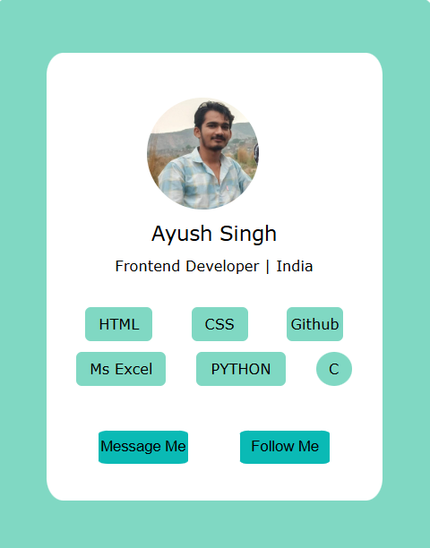

# Profile card website 

A simple and clean profile card webpage built with HTML and CSS. Hosted live using Github pages.

## 🔗 Live Website

Visit: [Live Website](https://ayush-singh-014.github.io/Profile-card/)

## 📂 Files Included

- index.html – Main profile card webpage
- style.css – Styling for the profile card
- Images – Profile picture and screenshot of my webpage 
  
## ✨ Features

- Responsive profile card layout
- Clean and minimal HTML + CSS structure
- Includes social links, profile image, and basic info

## 🚀 How to Use

You can clone or download this repository and simply open index2.html in any browser.

bash
git clone https://github.com/Ayush-singh-014/Profile-card.git
## 📸 Screenshot

## 🙋‍♂ Author

[Ayush Singh](https://github.com/ayush-singh-014)
